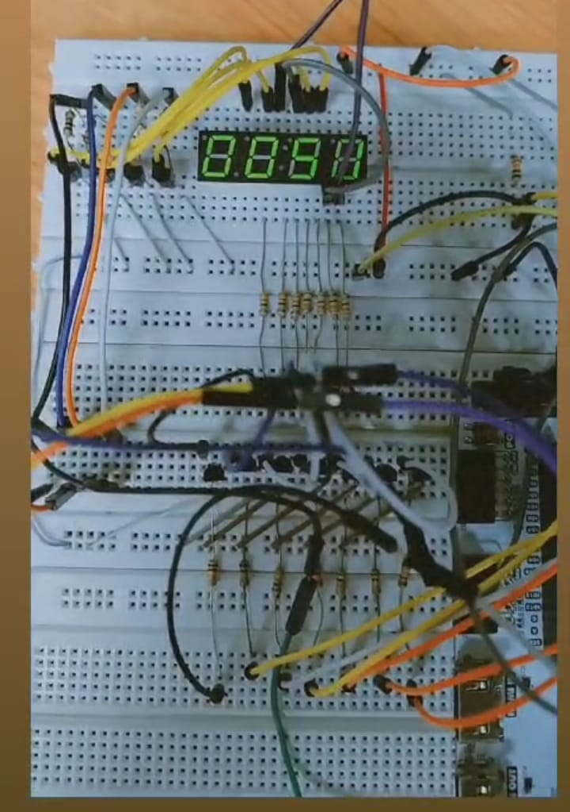

# FPGA Arty7 Stopwatch

Authors: Sebastian Montoya, Valentina Restrepo
Date: June 2022

## Introduction

This project implements a simple stopwatch using an FPGA (Arty7) and four 7-segment displays. The stopwatch has four states (S0, S1, S2, S3), each displaying a different digit on the 7-segment display. The stopwatch cycles through these states, creating a counting effect.

## Hardware Requirements

- FPGA board (Arty7)
- 4x 7-segment displays
- Appropriate interfacing hardware (wires, resistors, etc.)

## Code Overview

The project is written in VHDL and is organized as follows:

- `maquina_estados.vhd`: The top-level entity that describes the state machine and display control.

- `codificador.vhd`: A component used for converting the current state and number to the 7-segment display output.

## State Machine

The state machine has four states:

1. **S0:** Displays "3" on the 7-segment display.
2. **S1:** Displays "1" on the 7-segment display.
3. **S2:** Displays "5" on the 7-segment display.
4. **S3:** Displays "0" on the 7-segment display.

The stopwatch counts in a cyclic manner, transitioning from one state to the next after a certain number of clock cycles (controlled by the `max` constant).

## Getting Started

To implement this project on your FPGA board, you'll need to follow these general steps:

1. Set up your FPGA board with the required hardware (7-segment displays, wiring, etc.).

2. Load the project into your FPGA development environment (e.g., Xilinx Vivado).

3. Compile the project and generate a bitstream file.

4. Program the FPGA with the bitstream file.

5. Observe the stopwatch operation on the 7-segment displays.

## Customize and Extend

You can customize and extend this project by:

- Changing the `max` constant to adjust the speed of the stopwatch.
- Adding buttons or switches to control the stopwatch (start, stop, reset).
- Expanding the functionality to include minutes and seconds.

Feel free to modify the code to suit your specific requirements and experiment with different features.

## License

This project is provided under the MIT License - see the [LICENSE](LICENSE) file for details.

## Acknowledgments

We would like to thank the open-source FPGA community for their valuable resources and tutorials that inspired this project.
